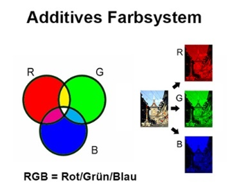
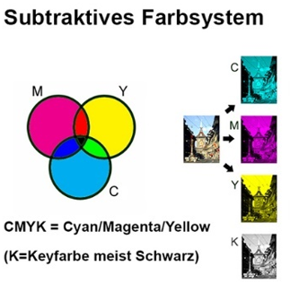

# Auftrag 1
Bestimmen sie die Farben für die folgenden RGB-Farbcodes (in HEX). Nutzen sie den RGB-Farbenmixer:

•	#FF0000 entspricht der Farbe ....<br>
•	#00FF00 entspricht der Farbe ....<br>
•	#0000FF entspricht der Farbe ....<br>
•	#FFFF00 entspricht der Farbe ....<br>
•	#00FFFF entspricht der Farbe ....<br>
•	#FF00FF entspricht der Farbe ....<br>
•	#000000 entspricht der Farbe ....<br>
•	#FFFFFF entspricht der Farbe ....<br>
•	#00BC00 entspricht der Farbe ....<br>

**Lösungsweg:**<br>
Um dies Aufgabe zu lösen ist die Folgende Grafik sehr Hilfreich:



Um diese Aufgabe zu verstehen muss man verstehen, wie eine Farbe Hexadezimal angezeigt wird.

`#FF0000` Diese Hexadezimale Zahl kann man in drei zweier paare unterteilen das erste in diesem Beispiel `FF` steht für den Rotfarben-Kanal. der Hexadezimale Wert `FF` repräsentiert die Dezimalzahl `255`. Das zweite paar repräsentiert den Grünfarben-Kanal. Der Hexadezimale Wert `00` repräsentiert die Dezimalzahl `0`, dies heisst das keine Grüntöne in dieser Farbe vorhanden sind. Das dritte paar `00` repräsentiert den Blaufarben-Kanal. Der Hexadezimale Wert `00` repräsentiert die Dezimalzahl `0`, dies heisst das keine Blautöne in dieser Farbe vorhanden sind.

Das heisst das die erste Farbe `#FF0000` den RGB-Farbcode `255 000 000` hat. Dies heisst diese Farbe ist `ROT`

- `#FF0000` entspricht der Farbe Rot und hat den RGB-Farbcode (255, 0, 0).
- `#00FF00` entspricht der Farbe Grün und hat den RGB-Farbcode (0, 255, 0).
- `#0000FF` entspricht der Farbe Blau und hat den RGB-Farbcode (0, 0, 255).
- `#FFFF00` entspricht der Farbe Gelb und hat den RGB-Farbcode (255, 255, 0).
- `#00FFFF` entspricht der Farbe Cyan und hat den RGB-Farbcode (0, 255, 255).
- `#FF00FF` entspricht der Farbe Magenta und hat den RGB-Farbcode (255, 0, 255).
- `#000000` entspricht der Farbe Schwarz und hat den RGB-Farbcode (0, 0, 0).
- `#FFFFFF` entspricht der Farbe Weiß und hat den RGB-Farbcode (255, 255, 255).
- `#00BC00` entspricht der Farbe Grün (Nuance) und hat den RGB-Farbcode (0, 188, 0).

# Auftrag 2
Bestimmen sie die Farben für die folgenden prozentualen CMYK-Angaben. Nutzen sie den CMYK-Farbenmixer:

•	C:0%, M:100%, Y:100%, K:0% entspricht der Farbe ....<br>
•	C:100%, M:0%, Y:100%, K:0% entspricht der Farbe ....<br>
•	C:100%, M:100%, Y:0%, K:0% entspricht der Farbe ....<br>
•	C:0%, M:0%, Y:100%, K:0% entspricht der Farbe ....<br>
•	C:100%, M:0%, Y:0%, K:0% entspricht der Farbe ....<br>
•	C:0%, M:100%, Y:0%, K:0% entspricht der Farbe ....<br>
•	C:100%, M:100%, Y:100%, K:0% entspricht der Farbe ....<br>
•	C:0%, M:0%, Y:0%, K:100% entspricht der Farbe ....<br>
•	C:0%, M:0%, Y:0%, K:0% entspricht der Farbe ....<br>
•	C:0%, M:46%, Y:38%, K:22% entspricht der Farbe ....<br>

**Lösungsweg:**<br>
Um dies Aufgabe zu lösen ist die Folgende Grafik sehr Hilfreich:



Die prozentualen CMYK-Angaben beschreiben den Farbaufbau wie folgt:

- **Cyan (C):** 0% - Es wird keine Cyan-Farbe verwendet.
- **Magenta (M):** 100% - Die Farbe besteht vollständig aus Magenta.
- **Yellow (Y):** 100% - Die Farbe besteht vollständig aus Yellow.
- **Key/Black (K):** 0% - Es wird kein Schwarz verwendet.

Daher ergibt sich aus diesen Angaben die Farbe:

- **Farbe:** Ein intensives Gelb.

Zusammengefasst lautet die Lösung:

`C: 0%, M: 100%, Y: 100%, K: 0%` entspricht der Farbe **intensives Gelb**.

- `C:0%, M:100%, Y:100%, K:0%` entspricht der Farbe **Gelb**.
- `C:100%, M:0%, Y:100%, K:0%` entspricht der Farbe **Magenta**.
- `C:100%, M:100%, Y:0%, K:0%` entspricht der Farbe **Cyan**.
- `C:0%, M:0%, Y:100%, K:0%` entspricht der Farbe **Gelb**.
- `C:100%, M:0%, Y:0%, K:0%` entspricht der Farbe **Rot**.
- `C:0%, M:100%, Y:0%, K:0%` entspricht der Farbe **Grün**.
- `C:100%, M:100%, Y:100%, K:0%` entspricht der Farbe **Weiß**.
- `C:0%, M:0%, Y:0%, K:100%` entspricht der Farbe **Schwarz**.
- `C:0%, M:0%, Y:0%, K:0%` entspricht der Farbe **Weiß**.
- `C:0%, M:46%, Y:38%, K:22%` entspricht einer spezifischen Farbmischung.

# Auftrag 3
Berechnen sie den Speicherbedarf für ein unkomprimiertes Einzelbild im HD720p50-Format bei einer True-Color-Farbauflösung.


**Lösungsweg:**<br>
Um den Speicherbedarf für ein unkomprimiertes Einzelbild im HD720p50-Format zu berechnen, benötigen wir einige Informationen. HD720p50 hat eine Auflösung von 1280x720 Pixeln und eine Bildwiederholrate von 50 Bildern pro Sekunde. True-Color bedeutet in der Regel 24 Bit pro Pixel (8 Bit pro Farbkanal).

Die Formel für den Speicherbedarf (in Bytes) pro Bild lautet:

```markdown
Speicherbedarf = (Breite in Pixel) × (Höhe in Pixel) × (Bit pro Pixel) / 8
```

Hier sind die Werte für HD720p50:

- Breite: 1280 Pixel
- Höhe: 720 Pixel
- Bit pro Pixel: 24 (True-Color, also 8 Bit pro Farbkanal für Rot, Grün und Blau)

Setzen wir diese Werte in die Formel ein:

```markdown
Speicherbedarf = (1280 × 720 × 24) / Byte
```
Um den Speicherbedarf in Bytes zu erhalten, teilen wir das Ergebnis durch 8 (weil 1 Byte = 8 Bit):

```markdown
Speicherbedarf = (1280 × 720 × 24) / 8 Byte
```

Die resultierende Zahl gibt den Speicherbedarf für ein Einzelbild im HD720p50-Format in Bytes an.


Es sieht so aus, als ob die Formatierung möglicherweise in Markdown für GitHub angepasst werden muss. Hier ist der Code in einer GitHub-freundlichen Markdown-Formatierung:


Jetzt, um die spezifischen Werte für HD720p50 einzusetzen:

```markdown
Speicherbedarf = (1280 × 720 × 24) / 8 Byte
```

Das Ergebnis dieses Ausdrucks gibt den Speicherbedarf für ein Einzelbild im HD720p50-Format in Bytes an. Beachten Sie, dass GitHub-Markdown keine direkten mathematischen Formeln unterstützt, daher ist dies eine einfache textbasierte Darstellung. Wenn Sie eine detailliertere mathematische Darstellung wünschen, sollten Sie andere Tools oder Formate verwenden.

# Auftrag 4
Welchen Speicherbedarf hat das Video aus der vorangegangenen Aufgabe bei einer Spieldauer von 3 Minuten?

**Lösungsweg:**<br>
Um den Speicherbedarf für das gesamte Video zu berechnen, müssen wir den Speicherbedarf pro Bild mit der Anzahl der Bilder multiplizieren, die pro Sekunde im Video erscheinen, und dies dann mit der Gesamtdauer des Videos in Sekunden multiplizieren. Die Formel lautet:

```markdown
Speicherbedarf für das Video = Speicherbedarf pro Bild x Bilder pro Sekunde x Gesamtdauer des Videos in Sekunden
```

Nun, für HD720p50:

- Bilder pro Sekunde (BPS): 50 (da es sich um HD720p50 handelt)
- Gesamtdauer des Videos: 3 Minuten

Hier ist die Formel in Markdown:

```markdown
Speicherbedarf für das Video = (Breite in Pixel × Höhe in Pixel × Bit pro Pixel / 8) × Bilder pro Sekunde × Gesamtdauer des Videos in Sekunden
```

Setzen Sie die spezifischen Werte für HD720p50 ein:

```markdown
Speicherbedarf für das Video = (1280 × 720 × 24 / 8) × 50 × 3 × 60
```

Das Ergebnis dieses Ausdrucks gibt den Gesamtspeicherbedarf für das Video in Bytes an. Um dies in größere Einheiten wie Megabyte oder Gigabyte zu konvertieren, können Sie das Ergebnis durch \( 1024 \times 1024 \) bzw. \( 1024 \times 1024 \times 1024 \) teilen.

# Auftrag 5
Ihre Digitalkamera bietet für die Speicherung ihrer Bilder folgende Formate an: RAW, TIF, JPG. Erklären sie in ein paar kurzen Sätzen die Unterschiede und Einsatzgebiete dieser drei Formatvarianten.

**Lösungsweg:**<br>
Die Formate RAW, TIF und JPG sind verschiedene Dateiformate, die in der Fotografie für die Speicherung von Bildern verwendet werden. Hier sind die Unterschiede und Einsatzgebiete in kurzen Sätzen erklärt:

1. **RAW (Rohdaten):** RAW ist ein unkomprimiertes Dateiformat, das alle Daten enthält, die von der Kamera aufgenommen wurden, ohne Verluste durch Kompression. Es bietet die höchste Qualität und Flexibilität bei der Bildbearbeitung, da es alle Bilddaten im Originalzustand speichert. Fotografen, die intensive Bearbeitungen vornehmen möchten, nutzen oft das RAW-Format. Es hat jedoch den Nachteil größerer Dateigrößen.

2. **TIF (Tagged Image File Format):** TIF ist ein verlustfreies, unkomprimiertes oder komprimiertes Dateiformat, das eine hohe Bildqualität beibehält. Es unterstützt auch Ebenen und ist weit verbreitet in der professionellen Bildbearbeitung und Druckindustrie. TIF-Dateien sind jedoch größer als JPG und eignen sich besonders für die Langzeitarchivierung von Bildern in höchster Qualität.

3. **JPG (Joint Photographic Experts Group):** JPG ist ein komprimiertes Dateiformat, das Verluste in der Bildqualität aufweisen kann, da es Informationen für eine kleinere Dateigröße komprimiert. Es ist ideal für den Alltagsgebrauch, Online-Veröffentlichungen und Situationen, in denen Dateigröße wichtig ist. JPG eignet sich weniger für intensive Bildbearbeitung, da jede erneute Speicherung zu weiterem Qualitätsverlust führen kann.

In Zusammenfassung: RAW bietet höchste Qualität und Bearbeitungsfreiheit, TIF bietet Verlustfreiheit und wird oft für professionelle Zwecke verwendet, während JPG für den alltäglichen Gebrauch und die effiziente Speicherung von Bildern geeignet ist, jedoch mit einem gewissen Qualitätsverlust.


# Auftrag 6
Berechnen sie den Speicherbedarf für ein unkomprimiertes Einzelbild im HD720p50-Format bei einer True-Color-Farbauflösung.

**Lösungsweg:**
Um den Speicherbedarf für ein unkomprimiertes Einzelbild im HD720p50-Format (High Definition 720p mit 50 Bildern pro Sekunde) bei True-Color-Farbauflösung zu berechnen, benötigen wir Informationen über die Bildgröße in Pixeln und die Farbtiefe.

**HD720p50-Auflösung:**
- HD720p hat eine Auflösung von 1280x720 Pixeln.

**True-Color-Farbauflösung:**
- True-Color verwendet in der Regel 24 Bit pro Pixel (8 Bit pro Farbkanal - Rot, Grün, Blau), was 2^24 Farben ermöglicht.

Die Formel zur Berechnung des Speicherbedarfs lautet:

Speicherbedarf (in Byte) = Breite X Höhe X Farbtiefe (in Byte pro Pixel)

Für das HD720p50-Format mit True-Color-Farben ergibt sich:

**Speicherbedarf = 1280 X 720 X 24/8 Byte**
<br>
**Speicherbedarf = 1280 X 720 X 3 Byte**
<br>
**Speicherbedarf = 2764800 Byte**
<br>
**Speicherbedarf ≈ 2.63 MB**

Also beträgt der Speicherbedarf für ein unkomprimiertes Einzelbild im HD720p50-Format bei True-Color-Farbauflösung etwa 2.63 Megabyte.

# Auftrag 7 
Welchen Speicherbedarf hat das Video aus der vorangegangenen Aufgabe bei einer 
Spieldauer von 3 Minuten?

Um den Speicherbedarf für das Video aus der vorangegangenen Aufgabe bei einer Spieldauer von 3 Minuten zu berechnen, benötigen wir zusätzliche Informationen über die Bildrate des Videos (Bilder pro Sekunde, fps). In der vorherigen Aufgabe wurde die Bildrate nicht explizit angegeben. Lassen Sie uns jedoch annehmen, dass die Bildrate 50 Bilder pro Sekunde beträgt, da dies im HD720p50-Format üblich ist.

Die Formel zur Berechnung des Speicherbedarfs für ein Video lautet:

**Speicherbedarf (in Byte) = Bildrate (fps) X Spieldauer (in Sekunden) X Speicherbedarf pro Bild (in Byte)**

Wir haben bereits den Speicherbedarf für ein Einzelbild berechnet<br> 
**Speicherbedarf pro Bild = 2764800 Byte**. Lassen Sie uns den Speicherbedarf für das gesamte Video berechnen:

**Speicherbedarf = 50fps X 3min X 60s/min X 2764800 Byte**
<br>
**Speicherbedarf ≈ 2488320000 Byte**
<br>
**Speicherbedarf ≈ 2.43 GB**

Also beträgt der Speicherbedarf für das Video bei einer Spieldauer von 3 Minuten (unter Annahme einer Bildrate von 50 fps) etwa 2.32 Gigabyte.

# Auftrag 8
Ihre Digitalkamera bietet für die Speicherung ihrer Bilder folgende Formate an: RAW, TIF, JPG. Erklären Sie in ein paar kurzen Sätzen die Unterschiede und Einsatzgebiete dieser drei Formatvarianten.

**Lösungsweg**
- **RAW (Rohdatenformat):** Dieses Format speichert die unverarbeiteten Daten direkt von der Kamera. Es bietet maximale Qualität und Flexibilität bei der Nachbearbeitung, eignet sich jedoch eher für professionelle Fotografen und Fortgeschrittene, da spezielle Software zur Bearbeitung benötigt wird.

- **TIF (Tagged Image File):** TIF ist ein verlustfreies Format, das hochwertige Bilder ermöglicht. Es wird häufig in der Druckindustrie und der professionellen Bildbearbeitung verwendet. Allerdings erzeugt es größere Dateien im Vergleich zu JPG und eignet sich daher besser für Projekte, bei denen die Dateigröße keine Hauptrolle spielt.

- **JPG (JPEG):** JPG ist ein komprimiertes Format, das Verluste in der Bildqualität zulässt, um Dateigröße zu reduzieren. Es eignet sich gut für den alltäglichen Gebrauch, insbesondere für Webseiten und soziale Medien, wo kleinere Dateigrößen wichtig sind. JPG eignet sich weniger für intensive Bildbearbeitung, da bei wiederholten Speicherungen Verluste auftreten können.

# Auftrag 9
Sie möchten Ihr neulich erstelltes Gameplay-Video auf YouTube veröffentlichen. Was sind die technischen Vorgaben dazu? (Format, Bildrate, Farbauflösung, Video-, Audiocodec etc.). Gibt es allenfalls rechtliche Einschränkungen?

**Lösungsweg**
- **Format:** YouTube empfiehlt das MP4-Format.
  
- **Bildrate:** Typischerweise 24, 25 oder 30 fps, je nach künstlerischer Präferenz.
  
- **Farbauflösung:** 8 Bit pro Farbkanal (True-Color) für ausreichende Farbgenauigkeit.
  
- **Video-Codec:** Häufig verwendet werden H.264 oder H.265 für gute Qualität bei akzeptabler Dateigröße.
  
- **Audio-Codec:** AAC mit mindestens 48 kHz für hochwertigen Ton.
  
- **Auflösung:** Abhängig von der verfügbaren Ausrüstung, üblich sind 1080p (1920x1080) oder 4K (3840x2160).
  
- **Rechtliche Einschränkungen:** Urheberrechte beachten, keine Verletzung von Richtlinien wie Gewalt oder Hassrede.

# Auftrag 10
Sie haben ein 30-Zoll-Display (Diagonale) im Format 16:10 und 100ppi erworben. Was ist die Pixelauflösung horizontal und vertikal?

**Lösungsweg**
- Bei einem 16:10-Verhältnis beträgt das Breiten-zu-Höhen-Verhältnis 16:10.
  
- Pixelauflösung horizontal: \(16 \times 100 \, \text{ppi} = 1600\) Pixel.
  
- Pixelauflösung vertikal: \(10 \times 100 \, \text{ppi} = 1000\) Pixel.

# Auftrag 11
Sie drucken ein quadratisches Foto mit einer Kantenlänge von 2000 Pixel mit 600dpi. Wie groß in cm wird dieses?

**Lösungsweg**
- Pixelgröße: \(2000 \times 2000\) Pixel.
  
- \(2000 \, \text{Pixel} / 600 \, \text{dpi} = 3.33 \, \text{Zoll}\).
  
- In Zentimetern umrechnen (2.54 cm pro Zoll): \(3.33 \, \text{Zoll} \times 2.54 \, \text{cm/Zoll} \approx 8.46 \, \text{cm}\).

# Auftrag 12
Ein kleiner Abstecher in die Welt der Töne: Bild-1 zeigt den Aufbau eines Mikrofons, Bild-2 den eines Lautsprechers. Was sind eigentlich vom technischen Prinzip her die Unterschiede?

**Lösungsweg**
- **Mikrofon:** Wandelt Schall in elektrische Signale um, nutzt Mikrofonelemente wie Kondensator oder Dynamik.
  
- **Lautsprecher:** Wandelt elektrische Signale in Schall um, nutzt Lautsprecherelemente wie Membran und Magneten.
  
- Beide nutzen grundlegend verschiedene Wandlerprinzipien für Ein- und Ausgang.

# Auftrag 13
Was ist der Unterschied zwischen dem Interlaced Mode und dem Progressive Mode?

**Lösungsweg**
- **Interlaced Mode:** Zeilenweise Darstellung von Bildern. Gerade und ungerade Zeilen werden abwechselnd dargestellt, was zu Interlacing-Artefakten führen kann.
  
- **Progressive Mode:** Vollständige Bilder werden nacheinander dargestellt. Jedes Bild enthält alle Zeilen, was zu einer gleichmäßigeren Darstellung führt.

# Auftrag 14
Ein RGB-Farbbild benutzt nur die Farbe Weiß als Hintergrund und ein Hellblau mit folgenden Werten: R=33, G=121, B=239 (8 Bit pro Farbkanal). Das Bild soll in ein Graustufenbild umgewandelt

 werden. Berechnen Sie den für das Hellblau entsprechende Grauwert. (8 Bit pro Farbkanal)

**Lösungsweg**
- Grauwertberechnung für Hellblau: \((33 + 121 + 239) / 3 = 127.67\).
  
- Der für das Hellblau entsprechende Grauwert beträgt etwa 128.

# Auftrag 15
Was versteht man unter Artefakten und welche kennen Sie?

**Lösungsweg**
- **Artefakte:** Unnatürliche oder unerwünschte Muster oder Verzerrungen in Bild- oder Tonaufnahmen.
  
- Beispiele: Blockartefakte bei zu starker JPEG-Kompression, Rauschen in Bildern oder Tonaufnahmen.

# Auftrag 16
Berechnen Sie die Bandbreite in GigaBit per Second oder kurz Gbps für die Übertragung eines unkomprimierten digitalen Videosignals HD1080i50 ohne Unterabtastung und 8 Bit Auflösung pro Farbkanal.

**Lösungsweg**
- \(1920 \times 1080 \times 50 \times 8 \, \text{Bit} = 7.3728 \, \text{Gbps}\).

# Auftrag 17
Nach wie vielen Minuten unkomprimierten HD1080i50 Video wäre eine DVD-5 (Single-Layer DVD mit 4.7GB) voll?

**Lösungsweg**
- 4.7 text{GB} / 7.3728 \, \text{Gbps} = 534.5 \, \text{s}\).

# Auftrag 18
Berechnen Sie, wie viel Speicher eingespart wird, wenn ein Bild mit Subsampling 4:1:1 komprimiert wird.

**Lösungsweg**
- 4 Teile Luminanz pro 1 Teil Chrominanz.
  
- (1 + 1 + 1/4 + 1/4 = 2.5\ Teile insgesamt.
  
- 100\% - (2.5/4 x 100%) = 37.5% Speichereinsparung.

# Auftrag 19
Was ist der Unterschied zwischen einem Codec und einem Mediencontainer?

**Lösungsweg**
- **Codec:** Codiert/decodiert Audio- oder Videodaten. Beispiel: H.264.
  
- **Mediencontainer:** Enthält Audio- und Videodaten, sowie Metadaten. Beispiel: MP4, MKV.

# Auftrag 20
Erstellen Sie einen vertonten Videoclip von ca. 5…10 sec. Dauer. Dazu filmen Sie z.B. mit Ihrem Smartphone kleine Sequenzen und schneiden diese später zusammen. Man kann auch Audio-Material wie Begleitmusik etc. vom Internet herunterladen und einbauen. (Bei Veröffentlichung Ihres Videos bitte die Copyrights beachten.)

**Lösungsweg**
- Verwenden Sie eine Videobearbeitungssoftware wie Adobe Premiere oder iMovie.
  
- Filmen Sie kurze Sequenzen mit Ihrem Smartphone.
  
- Schneiden Sie die Sequenzen zusammen und fügen Sie Audio-Material ein.
  
- Achten Sie darauf, lizenzierte Materialien legal zu verwenden und die Copyright-Bestimmungen zu beachten.
  
- Exportieren Sie das Video im gewünschten Format für die Veröffentlichung.

•RGB 255/255/255 ergibt in YCbCr....
• RGB 0/0/0 ergibt in YCbCr....
• Y:1, Cb:0, Cr:0 entspricht der Farbe ....
• Y:0, Cb:0, Cr:0 entspricht der Farbe ....
• Y:0, Cb:0.5, Cr:0 entspricht der Farbe ....
• Y:0, Cb:-0.5, Cr:0 entspricht der Farbe ....
• Y:0, Cb:0, Cr:0.5 entspricht der Farbe ....
• Y:0, Cb:0, Cr:-0.5 entspricht der Farbe ....
• Y:0.3, Cb:0.5, Cr:-0.17 entspricht der Farbe ....

• RGB 255/255/255 ergibt in YCbCr 1-0-0 <br>
• RGB 0/0/0 ergibt in YCbCr 0-0-0 <br>
• Y:1, Cb:0, Cr:0 entspricht der Farbe WEISS <br>
• Y:0, Cb:0, Cr:0 entspricht der Farbe SCHWARZ <br>
• Y:0, Cb:0.5, Cr:0 entspricht der Farbe ROT <br>
• Y:0, Cb:-0.5, Cr:0 entspricht der Farbe GRÜN <br>
• Y:0, Cb:0, Cr:0.5 entspricht der Farbe BLAU <br>
• Y:0, Cb:0, Cr:-0.5 entspricht der Farbe GRÜN <br>
• Y:0.3, Cb:0.5, Cr:-0.17 entspricht der Farbe ROT <br>

# Reflexion

**Unterrichtsinhalte und Ziele:**

Ich habe mein Ziel erfüllt

**Unterrichtsresultate:**

Dieses Dokument

**Probleme/Knacknüsse:**

DCT-Verarbeitungsschritte, Verlustbehaftete Komprimierung hat mir einige Probleme gemacht aber mit eingigen Videos konnte ich diese bewältigen.

**Neue Applikationen, Werkzeuge, Kommandos, etc.:**

--Keine mir unbekannte Applikationen, Werkzeuge, Kommandos oder weiteres genutzt--

**Offene Fragen:**
Ich habe folgende Fragen:

- [ ] DCT

- [ ] Verlustbehagtete Komprimierung

- [ ] Bandbreite und Artefakte


